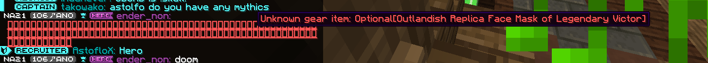

## Name
**Name** is stored as a String. It must be a valid Wynncraft item for it to display as intended.

NOTE: in game, the name has a limit of 48 characters.  
That means that the final tier Legendary Island item,  
"Outlandish Replica Face Mask of Legendary Victory",  
only encodes up to "Victor". Thus, it does not work in game.
