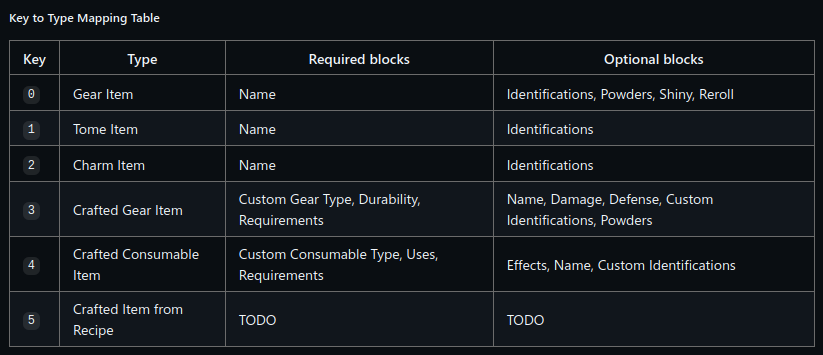

# Config Guide

## The required blocks
According to the [Wynntils Artemis encoding proposal Github Issue](https://github.com/Wynntils/Wynntils/issues/2246),  
the allowed blocks should look like this:

However, it's inaccurate. This is what it SHOULD look like:

 ##### Key to Type Mapping Table  

| Key | Type                     | Required blocks                            | Optional blocks                                             |
|-----|--------------------------|--------------------------------------------|-------------------------------------------------------------|
| `0` | Gear Item                | Name                                       | Identifications, Powders, Shiny, Reroll                     |
| `1` | Tome Item                | Name                                       | Identifications, Reroll                                     |
| `2` | Charm Item               | Name                                       | Identifications, Reroll                                     |
| `3` | Crafted Gear Item        | Custom Gear Type, Durability, Requirements | NameAfter, Damage, Defense, Custom Identifications, Powders |
| `4` | Crafted Consumable Item  | Custom Consumable Type, Uses, Requirements | Effects, NameAfter, Custom Identifications                  |
| `5` | Crafted Item from Recipe | TODO                                       | TODO                                                        |

## Documentation for each block:
- [Item type](blocks/type.md)
- [Name](blocks/name.md)
- [Shiny](blocks/shiny.md)
- [Powder Limit](blocks/powderlimit.md)
- [Powder](blocks/powder.md)

## Identifications
### Format
Inside the "ids":[] array, set it up in the following structure.  
**{"id": "$ID","base": $BASE,"roll": $ROLL}**  
**ID** is stored as a string corresponding to the Wynntils internal ID string of any roll. See here for a list: https://raw.githubusercontent.com/Wynntils/Static-Storage/main/Reference/id_keys.json .  
**BASE** is the base roll. The default base data is defined in (WARNING: EXTREMELY MASSIVE TEXT FILE) https://raw.githubusercontent.com/Wynntils/Static-Storage/main/Reference/gear.json .  
Beautify it then look for `ITEMNAME > identifications > IDENTIFICATIONNAME > raw` for default value. This base value defines the listed ID ranges.  
**ROLL** defines the actual rolled value for the Identification. The formula is `BASE * ROLL / 100`. Most values are in the range 30-130 due to how Wynncraft handles many Identifications as 30-130 percent of a base stat. Thus, if you are trying to find the ROLL value, try your desired roll **(NOT the roll percentage 1-100)** divided by the BASE then round it to the nearest integer. This value is optional, and you should only exclude it when it is a fixed value e.g. Skill Points.

## Rerolls
Optional single value, i8. Stores number of rerolls. If missing or is 0, rerolls are not encoded.  
Potential range: 0<->255.

### Other things about this
The format obeys the same json rules as the powders.  
If you are trying to get the 100% or 0% roll and the value you calculated is close to 130 or 30, change it to 130 or 30 because that is the real value.
However, if the value is negative it will be between 70%-130%. 

# Current issues
Crafteds are not implemented